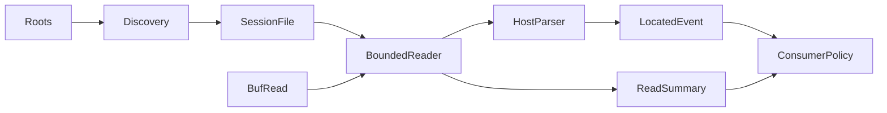

# v0.1 technical contract

Iterator<Item = Result<Located<Event>, StreamError>>; finish consumes the reader
without draining it. Reaching physical/snapshot EOF is not sufficient when
undelivered events remain: finish then reports StoppedEarly. A final next()==None
establishes completion. Terminal I/O errors are yielded once; subsequent next
returns None and summary remains Failed. Line errors are counted and recoverable.

Locations: record_index is zero-based physical JSONL ordinal, including blanks;
line_no is one-based; byte_start inclusive, byte_end exclusive includes delimiters;
event_index is a canonical slot independent of filtering: 0=Meta, 1=Message,
2=Usage, 3+block-index=tools (standalone Codex tool slot=3). IDs, session IDs
and paths are not interchangeable. Slots may have gaps. Only selected payloads
are validated/materialized; common provenance and JSON syntax are always checked.

Reader uses fill_buf/consume, bounded by max_line_bytes before allocation. Drain
oversized records to the next delimiter without retaining them. max_file_bytes
bounds bytes consumed even for generic streams. stop_at_byte is a required exact
snapshot length; short input errors and a cut JSON value follows tail policy.
It is a boundary, not permission to accept a truncated file. Complete record
checkpoint does not advance across any line error or incomplete record, and does
not commit a partially delivered record. Snapshot mutation in place cannot be
detected from length alone: callers needing immutability must seal/verify content.

Defaults: 200 MiB file, 8 MiB line, strict tail, all events. Limits may be
overridden. Unknown-type counters are capped at 128 distinct bounded labels plus
an overflow bucket; the parser retains only current model/session/cumulative
state and current-record events. No global dedup state or implicit logging.

Types serialize for fixture testing. Public enums are non_exhaustive. Additive
fields remain ordinary 0.x API changes; non_exhaustive does not protect exhaustive
struct literals. Avoid broad regexes and dependencies beyond serde/json/chrono.

Alternatives: (1) shared pure record decoder alone has a smaller API but leaves
three implementations of tail/limits/provenance; (2) routing all consumers through
remem couples statistics to a database/service; (3) chosen library separates
bounded IO and source normalization from every consumer's storage/filtering.

Risks: format drift -> diagnostics + fixtures; double counting -> explicit usage
mode and source IDs; data loss -> completeness status and immutable locations;
oversized rows -> preallocation limits; compatibility -> retain raw counter
semantics and evaluate each adapter against its pinned baseline independently.

Implementation: types/roots/discovery, bounded reader, Claude decoder, Codex
decoder, fixture/contract tests, read-only scan example, documentation and CI.
Numeric and field errors must preserve previously parsed records but may not
silently yield a partial record. Parser state updates are atomic per record.
